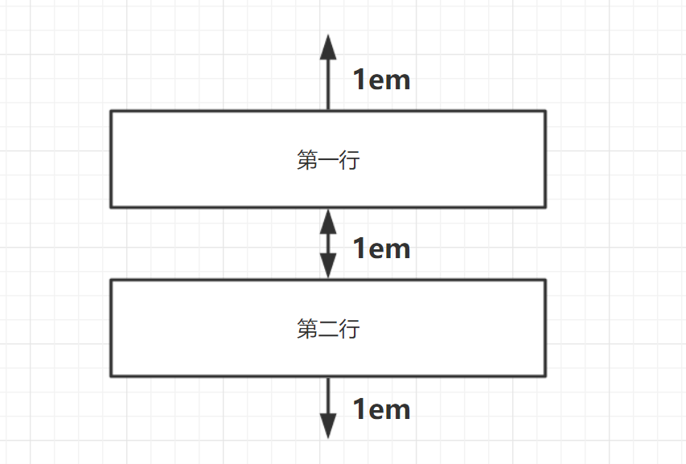
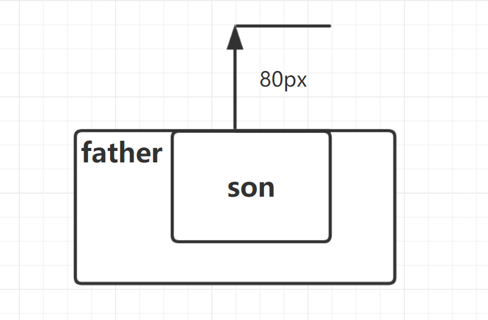

## 前言

之前面试的时候面到了margin合并，当时答得并不好，因此特意看一下《CSS世界》这本书。

## padding

### 作用

CSS默认的box-sizing是content-box，所以使用padding会增加元素的尺寸，一般来说padding增加的是元素的内边距，这也是盒子模型中计算宽度大小的一项。

### 百分比值

padding百分比值无论是水平还是垂直方向均是相对于宽度计算的(父元素宽度)，这一点与margin的百分比值相同

## border

border增加的是元素的边框，是盒子模型的一部分，应用也相当广泛

### 注意点

- `border-width`不支持百分比

## margin

margin增加的是元素的外边距，并不影响盒子的实际宽度，但是影响页面的布局。

### margin的百分比值

无论是水平方向还是垂直方向，margin的百分比值相对于父元素宽度计算的。例如：

```html html
<style>
  .father {
    width: 300px;
    height: 200px;
  }

  .son {
    width: 150px;
    margin-top: 20%; /* margin-top: 300 * 20% = 60px */
  }
</style>
<div class="father">
  <div class="son"></div>
</div>
```

### margin 合并

#### 解释

块级元素(不包括浮动和绝对定位元素)的上外边距(margin-top)和下外边距(margin-bottom)有时会合并为单个外边距，这种现象称为“margin 合并”。一般情况下，只发生在垂直方向。

#### 发生合并的 3 种场景

1. 相邻兄弟元素的 margin 合并

```html html
<style>
  p {
    margin: 1em 0;
  }
</style>
<p>第一行</p>
<p>第二行</p>
```



2. 父级的第一个/最后一个子元素

```html html
<style>
  .father {
    margin-top: 80px;
  }

  .son {
    margin-top: 80px;
  }
</style>
<div class="father">
  <div class="son">hello</div>
</div>
```



解决措施：

对于 margin-top 的合并：

- 父元素设置为格式化上下文元素，例如`overflow: hidden;`
- 父元素设置 padding-top 值
- 父元素和第一个子元素之间添加内联元素进行分隔(标签内不能为空)

对于 margin-bottom 的合并：

- 父元素设置为格式化上下文元素
- 父元素设置 padding-bottom 值
- 父元素和最后一个子元素之间添加内联元素进行分隔
- 父元素设置 height、min-height 或 max-height(注意设置时的大小，设置太小会部分合并)

3. 空块级元素的 margin 合并

`.father`这个元素的高度只有 80px，垂直方向上的 margin-top 和 margin-bottom 合并在一起了

```html html
<style>
  .father {
    overflow: hidden;
  }

  .son {
    margin: 80px 0;
  }
</style>
<div class="father">
  <div class="son"></div>
</div>
```

#### margin 合并的计算规则

1. **“正正取大”**：如果两个margin都为正值，最终结果取其中较大的值
2. **“正负相加”**：如果两个margin为一正一负，最终结果取两个值之和
3. **“负负取小”**：如果两个margin都为负值。最终结果取其中较小的值

### margin: auto

规则如下：

1. 如果一侧是定值，一侧auto，则auto为剩余空间大小
2. 如果两侧为auto，则平分剩余空间

例如规则1：

```html html
<style>
  .father {
    width: 300px;
    height: 300px;
  }

  /* margin-left: (300px - 200px - 80px) */
  .son {
    width: 200px;
    height: 100px;
    margin-left: auto;
    margin-right: 80px;
  }
</style>
```

`margin: auto`触发的条件：width或height为auto时，元素具有对应方向的自动填充特性，一般来说width为auto时是自动填充的，因此左右方向的auto有效，但是height为auto时不时自动填充的，因此auto失效；当然还需要是块级元素

### margin无效场景

1. 对于内联替换元素，不会发生margin合并问题，同时垂直方向的margin失效
2. 表格中tr和td元素设置display计算值是table-cell或table-row的元素的margin都是无效的