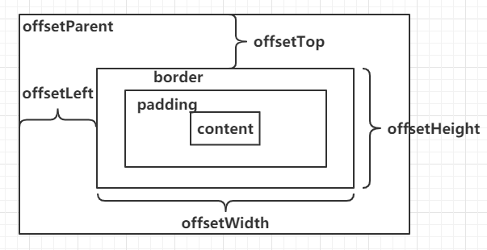
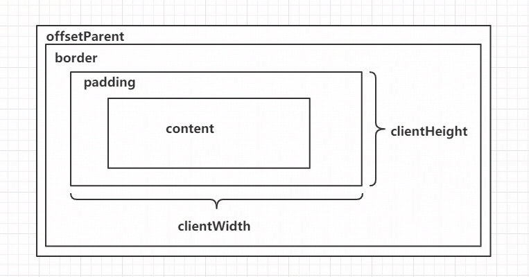
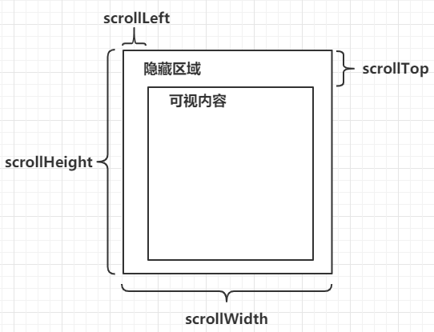

## 前言

本文根据高程中的十二章来写的，相当于个人的读书笔记。

## DOM变化

### node类型

- isSameNode(ele): 表示引用的节点是否相同
- isEqualNode(ele): 比较两个节点是否相等，相等指的是相同类型+相等的属性+相等的值

```js js
const div1 = document.createElement('div');
div1.className = 'box';
const div2 = document.createElement('div');
div2.className = 'box';
console.log(div1.isSameNode(div1)); // true
console.log(div1.isEqualNode(div2)); // true
console.log(div1.isSameNode(div2)); // false
```

- setUserData(key, value, func): **已废弃**
- getUserData(key): **已废弃**

## 样式

### 访问元素的样式

> 任何支持style特性的HTML元素在JavaScript中都有一个对应的style属性，这个style对象是CSSStyleDeclaration的实例

- cssFloat: 因float是js的保留字，IE9以上支持

#### DOM样式属性和方法

- cssText: 访问style中的CSS代码
- length: style内属性的长度
- parentRule: 表示CSS信息的CSSRule对象
- getPropertyCSSValue(): **已废弃**
- getPropertyPriority(proptyName): 如果给定的属性使用了!important设置，则返回"important"；否则，返回空字符串
- getPropertyValue(proptyName): 返回给定属性的字符串值
- item(index): 获取属性
- removeProperty(proptyName): 从样式中删除给定属性
- setProperty(propertyName, value, priority): 将给定的属性设置为相应的值，并加上优先权标志(也可不加)

html代码
```html html
<div style="width: 100px; height: 100px; background-color: pink;" id="box">123</div>
```

```js js
const div = document.getElementById('box');
console.log(div.style.cssText); // 'width: 100px; height: 100px; background-color: pink;'
// div.style.cssText = 'color: red'; // 新写的属性直接覆盖原来的
console.log(div.style.length); // 3
for (let i = 0, len = div.style.length; i < len; i++) {
  const prop = div.style.item(i);
  console.log(prop, div.style[i], div.style.getPropertyValue(prop));
}
// width width 100px
// height height 100px
// background-color background-color pink

div.style.removeProperty('width'); // 移除width属性
div.style.setProperty('width', '200px', 'important'); // 加上width属性
```

#### 计算的样式

> "DOM2级样式"增强了document.defaultView，提供了`getComputedStyle()`方法。这个方法接收两个参数：取得计算样式的元素和一个伪元素字符串。如果不需要伪元素信息，第二个参数可以是`null`;所有计算的样式都是只读的；不能修改计算后样式对象中的CSS属性，同时任何具有默认值的CSS属性都会表现在计算后的样式中，但是默认样式在不同浏览器中值可能不一样。

```html html
<head>
  <style>
    #box {
      width: 200px !important;
      height: 150px !important;
    }
  </style>
</head>
<body>
   <div style="width: 100px;height: 100px; background-color: pink;" id="box">123</div>
    <script>
      const div = document.getElementById('box');
      const computedStyle = document.defaultView.getComputedStyle(div, null);
      console.log(computedStyle.width); // 200px
    </script>
</body>
```

### 操作样式表

对定义在link和style元素内的css进行操作，因实际用途不大就不详细介绍了。

### 元素大小

#### 偏移量

- offsetHeight: 元素在垂直方向上占用的空间大小
- offsetWidth: 元素在水平方向上占用的空间大小
- offsetLeft: 元素的左外边框至包含元素的左内边框之间的像素距离
- offsetTop: 元素的上外边框至包含元素的上内边框之间的像素距离

图示：
<!--  -->


示例代码如下：

html结构

```html html
<section class="sec1">
  <div class="content"></div>
</section>
```

css结构

```css css
body {
  margin: 15px;
}

.sec1 {
  width: 500px;
  height: 400px;
  background-color: #eee;
  padding-top: 150px;
}

.content {
  width: 100px;
  height: 100px;
  padding: 15px;
  border: 5px solid;
  background-color: purple;
  margin-left: 130px;
}
```

```js js
const content = document.querySelector('.content');
const { offsetWidth, offsetHeight, offsetLeft, offsetTop, offsetParent } = content;
console.log(offsetWidth, offsetHeight, offsetLeft, offsetTop); // 140px(100 + 2 * 15 + 2 * 5) 140px 145px(130 + 15) 165px(150 + 15)
console.log(offsetParent); // body节点
```

#### 客户区大小

- clientWidth: 元素内容区宽度加上左右内边距宽度，content-width + padding-left + padding-right
- clientHeight: 元素内容去高度加上上下内边距高度，content-height + padding-top + padding-bottom

图示：
<!--  -->


注意： 如果该元素是滚动元素，那么还需要减去滚动条宽度或高度，在chrome中滚动条的宽度和高度都是`17px`

```js js
const { clientWidth, clientHeight } = content;
console.log(clientWidth, clientHeight); // 130px(100 + 2 * 15) 130px
```

#### 滚动大小

- scrollHeight: 在没有滚动条的情况下，元素内容的总高度
- scrollWidth: 在没有滚动条的情况下，元素内容的总宽度
- scrollLeft: 被隐藏在内容区域左侧的像素数
- scrollTop: 被隐藏在内容区域上方的像素数

图示：
<!--  -->


举例：
```html html
<!DOCTYPE html>
<html lang="en">
  <head>
    <style>
      body {
        margin: 15px;
      }

      .sec1 {
        width: 500px;
        height: 400px;
        background-color: #eee;
        padding-top: 150px;
        overflow: scroll;
      }

      .content {
        width: 600px;
        height: 500px;
        padding: 15px;
        border: 5px solid;
        background-color: purple;
        margin-left: 130px;
      }
    </style>
  </head>
  <body>
    <section class="sec1">
      <div class="content"></div>
      </div>
    </section>
    <script>
      const sec = document.querySelector('.sec1');
      const { scrollHeight, scrollWidth, clientWidth, clientHeight } = sec;
      content.scrollLeft = 20;
      content.scrollTop = 100;
      const { scrollLeft, scrollTop } = content;
      // 690(540+150) 770(600+40+130) 20 100
      console.log(scrollHeight, scrollWidth, scrollLeft, scrollTop);
      // 483(500-17) 533(400+150-17)
      console.log(clientWidth, clientHeight);
    </script>
  </body>
</html>
```

#### 确定元素大小

getBoundingClientRect()

- left: 元素最左边border离页面最左边的距离
- right: 元素最右边border离页面最左边的距离
- top: 元素最上边border离页面最上边的距离
- bottom: 元素最下边border离页面最上边的距离

图示如下：
<!--  -->


## 遍历

### NodeIterator

> 使用document.createNodeIterator()方法创建它的新实例。该方法接收四个参数(root、whatToShow, filter, entityReferenceExpansion)。

- root: 想要作为搜索起点的书中的节点
- whatToShow: 表示要访问哪些节点的数字代码
- filter: 是一个NodeFilter对象，或者一个表示应该接收还是拒绝某种特定节点的函数
- entityReferenceExpansion: bool值，表示是否要拓展实体引用。在HTML中无效

> whatToShow是一个位掩码，通过应用一或多个过滤器来确定要访问哪些节点，这个参数的值以常量形式在NodeFilter类型中显示

- NodeFilter.SHOW_ALL: 显示所有类型的节点
- NodeFilter.SHOW_ElEMENT: 显示元素节点
- NodeFilter.SHOW_TEXT: 显示文本节点
- NodeFilter.SHOW_COMMENT: 显示注释节点
- NodeFilter.SHOW_DOCUMENT: 显示文档节点
- NodeFilter.SHOW_DOCUMENT_TYPE: 显示文档类型节点
- ...: 对HTML页面没有用
- NodeFilter.FILTER_ACCEPT: 访问给定的节点
- NodeFilter.FILTER_SKIP: 不访问给定的节点

**方法：**

- nextNode(): 用于向前前进一步
- previouseNode():  用于向后后退一步

```js js
// 只显示p元素的节点迭代器
const filter = {
  acceptNode(node) {
    return node.tagName.toLowerCase() === 'p' ? NodeFilter.FILTER_ACCEPT : NodeFilter.FILTER_SKIP;
  }
}
// 两种方法都可
const filter = (node) => {
  return node.tagName.toLowerCase() === 'p' ? NodeFilter.FILTER_ACCEPT : NodeFilter.FILTER_SKIP;
}

const iterator = document.createNodeIterator(root, NodeFilter.SHOW_ELEMENT, filter, false);
```

**DOM遍历举例**

```html html
<div id="div1">
  <p><b>Hello</b> world!</p>
  <ul>
    <li>List item 1</li>
    <li>List item 2</li>
    <li>List item 3</li>
  </ul>
</div>
```

```js js
const div = document.getElementById('div1');
const filter = (node) => {
  return node.tagName.toLowerCase() === 'li' ? NodeFilter.FILTER_ACCEPT : NodeFilter.FILTER_SKIP;
}
const iterator = document.createNodeIterator(div, NodeFilter.SHOW_ELEMENT, filter, false);
let node = iterator.nextNode();
while(node !== null) {
  console.log(node.tagName); // DIV P B UL LI LI LI
  node = iterator.nextNode();
}
```

### TreeWalker

> TreeWalker是NodeIterator的一个更高级的版本。除了包括nextNode()和previousNode()在内的相同功能之外，还提供了其他方法。

- parentNode(): 遍历到当前节点的父节点
- firstChild(): 遍历到当前节点的第一个子节点
- lastChild(): 遍历到当前节点的最后一个子节点
- nextSibling(): 遍历到当前节点的下一个同辈节点
- previousSibling(): 遍历到当前节点的上一个同辈节点

通过`document.createTreeWalker()`方法创建，接收的参数与NodeInterator相同，除了`NodeFilter.FILTER_ACCEPT`和`NodeFilter.FILTER_SKIP`，还增加了`NodeFilter.REJECT`，它的作用是跳过**相应的节点及该节点的整个子树**

currentNode: 表示任何遍历方法在上一次遍历中返回的节点。

## 范围

- document.createRange(): 创建DOM范围

个人认为应用场景较小，因此不过多介绍。